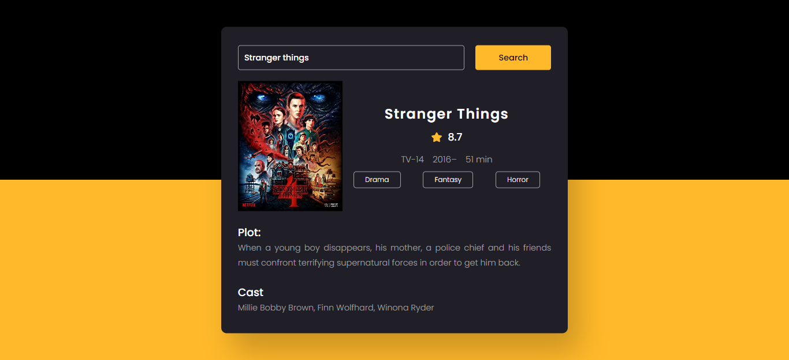

<div align="center">
    <h1 align="center">Create a movie guide app with HTML, CSS and Javascript using the OMDb API 🎬.</h1>
    <p>Criação de um site com tema sobre filmes, onde a pessoa digita o nome e buscamos as informações no OMDb API.</p>
    
</div>

---
<h3 align="center">
  <a href="https://movie-guide-app-javascript.vercel.app/">Acessar demonstração</a>
</h3>

## Índice

* [Descrição](#descrição)
* [Techs](#techs)
* [Design](#design)
  * [Cores](#cores)
  * [Tipo de fonte](#tipo-de-fonte)
  * [Pacote de ícones](#pacote-de-ícones)
* [Instalação](#instalação)
* [Links Contato](#links-contato)

# Descrição
Criação de um site com tema sobre filmes, onde a pessoa digita o nome e buscamos as informações no OMDb API. [**@Code Artist**](https://www.youtube.com/c/CodingArtist)

# Techs: 
- **HTML**
- **CSS**
- **Javascript**

# Design:
- O modelo final para desktop está disponível na pasta `./design`
- Imagens disponíveis na pasta `./assets`<br>

## Cores:
--yellow: #ffb92a;<br>
--white: #fff;<br>   
--gray: #a0a0a0;<br>
--black: #000;
## Tipo de fonte:
- **Poppins** Regular 400, Medium 500, Bold 600

## Pacote de ícones:
- **Boxicons**

# Instalação:
```bash
  # Clone este repositório:
  $ git clone https://github.com/GabrielChagas1/movie-guide-app-javascript.git
  $ cd ./movie-guide-app-javascript
```

# Links Contato
- **Linkedin:** https://www.linkedin.com/in/gabriel-serqueira-chagas/<br>
- **GitHub:** https://github.com/GabrielChagas1<br>